## ROCC Device Installation
### How to configure Tx without Boxilla

	• Connect Tx and RX back to back 
	• Power ON device
	• On Rx OSD >> Go To CONTROL Tab
	• Select Transmitter 
	• If you know IP address enter IP 192.168.1.22 >> click on apply
	• Click on Network to configure New IP address
	• If you don’t know IP address of Tx, then click on Discover and restart Tx
	• Tx IP will be displayed, then Click on Network to configure IP address
	• Now go to Boxilla > Discover > Add Manually > enter the IP address of Rx/Tx > click on get information

### Configuring Transmitter Connection 
	• Go To connections >> Manage >> + Connection
	• Enter Connection Name and IP address
	• Click on Next

 Select Connection Type Private or shared. If you select connection type PRIVATE, system will accessible by ONE user at any given point of time. If you select connection type SHARED, system will be accessible by MORE THAN ONE users at a time.

### Configuring Connection – View Only 
	• Go To connections >> Manage >> + Connection
	• Enter Connection Name and IP address
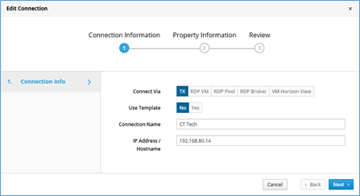

	• Select view only and click on NEXT >> Review and Save

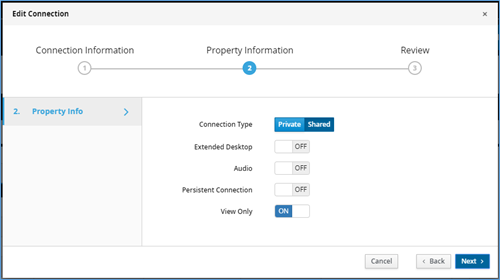

	
### Changing Display resolution on Transmitter.

	• Go to Devices >>Settings >> Click on Click on grey color botton (Round in shape with 3 dots on it), select edit settings

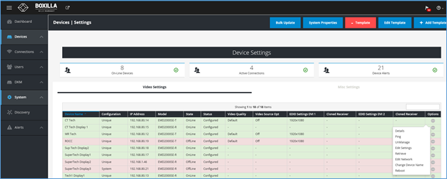

Select desired screen resolution from dropdown (EDID Settings DVI 1) and save

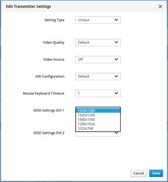

### User configuration and Management
	• Go to user >> Manage >> +user
	• Enter desired username and password.

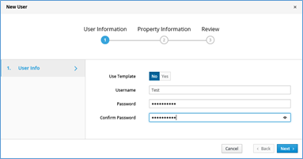

	• Click on Next
	• Select user privilege and select Auto connect ON/OFF

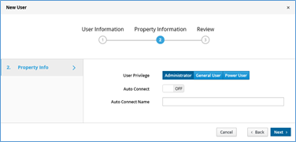

	• Adding devices to the users based on their Role. Click on grey color botton (Round in shape with 3 dots on it), then go to manage connections

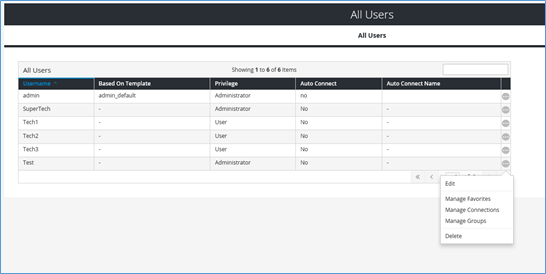

	•  Select the device and click on right arrow button

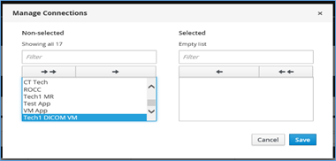

	•  click on save.

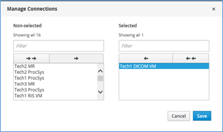

### How to Know Active users

Click on connection >> Active. This will display the active sessions

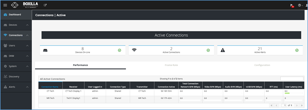

## Configuring Freedom II (Glide and switch) 
	• Download software on a local computer.
	• Connect computer directly or indirectly to Freedom II unit.
	• Open the software to configure the layout of the monitors as desired.
	
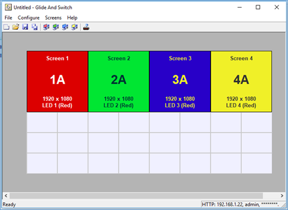

	• Go to Configure >> Connection >> Network Tab and configure IP address , username and password 

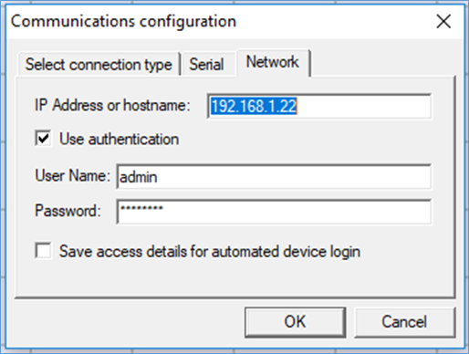

	• Flash the Monitor layout Freedom II
	• Glide and switch feature is enabled now.

## Spoke Relay Configuration without ROCC Central Manager

	1. Connect Display, Keyboard, and Mouse to an "unmanaged" Command Center Relay (CC Relay) (EMD2000SE-R / EMD2002SE-R)
	2. Power on the CC Relay
	3. Connect a Spoke Relay (EMD200SE-T, EMD2002SE-T, EMD200DV-T) to the CC Relay with a network cable. Power on the spoke relay
	4. On the CC Relay display log in. Default is admin/admin
	5. Navigate to the "Control" tab

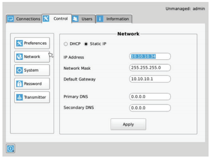

	6. Click the "Transmitter" button on the left hand side
	7. Input the following IP address into the "Transmitter IP Address" field: 192.168.1.22
	8. Click "Apply"
	9. Click the "Network" button
	10. Enter the correct network settings
	11. Click "Apply"
    12. Transmitter should restart and have the new network settings applied