### Configuring Boxilla

	• Boxilla is accessible via IP address 192.168.1.24 (Factory Default)
	• Connect Boxilla LAN port to a laptop/computer LAN port by using LAN cable.
	• Go to Network Connections and configure IP address 192.168.1.23 >> enter tab , subnet mask will be filled automatically >> click on OK
	• Open browser and enter URL https://192.168.1.24
	• Enter username and password ( admin/admin by default)
	• If you would like to change the IP address click on system>> Settings. 

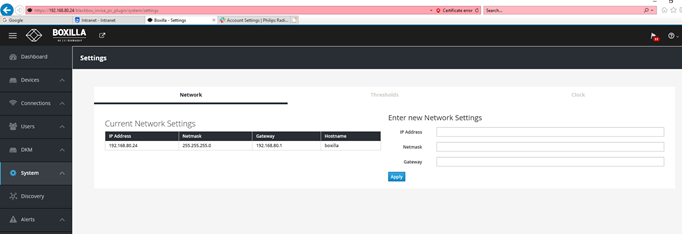

	• Enter new IP address; Subnet mask; Gateway and click on save. Now boxilla will lose connectivity 
	• Remove the LAN cable from Boxilla and connect it to a network from where new IP address is accessible.
	• Revert network changes on laptop/computer or use a customer laptop/computer and ping boxilla to make sure it is reachable.
	• Open browser and enter new IP address to access boxilla https://XXX.XXX.XXX.XXX
	• By Default Transmitter IP address will be 192.168.1.22 and Receiver IP will be 192.168.1.21.
	• Click on Discovery to check what are the devices ( Tx/Rx) connected to network.
	• If Multicast is enabled at customer network Rx/Tx will be discovered, Once you click on Discovery >> Automatic Discovery

![](media/Boxilla2.png
     

	• If multicast is not enabled we have to connect the device in the same vlan where boxilla is  connected or we have to manually 
		Discovery >> Add Manually
		Enter IP address >> Get Information
		Enter Device Name to Manage.
	• Tx/Rx will be discovered with IP address 192.168.1.22 and 192.168.1.21 respectively, if factory default setting is not altered.
	• Change the IP address to desired subnet and save the changes.
		Devices >> Setting >> Select the device for which IP has to be changed >> click on options >> Edit network
		Enter desired IP address

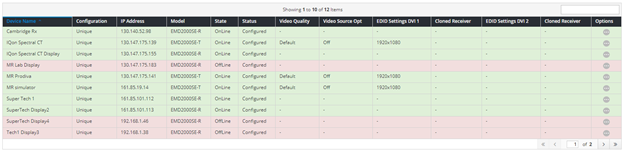

### Configuring Transmitter Connection 

	• Go To connections >> Manage >> + Connection
	• Enter Connection Name and IP address
	• Click on Next

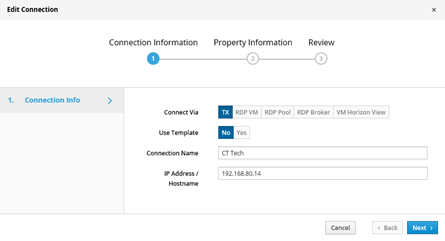

 Select Connection Type Private or shared. If you select connection type PRIVATE, system will accessible by ONE user at any given point of time. If you select connection type SHARED, system will be accessible by MORE THAN ONE users at a time.

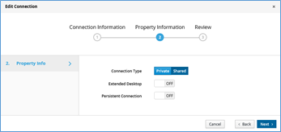

### Configuring Connection – View Only 
	• Go To connections >> Manage >> + Connection
	• Enter Connection Name and IP address
	
	
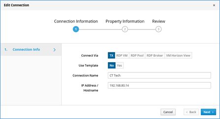

	• Select view only and click on NEXT >> Review and Save

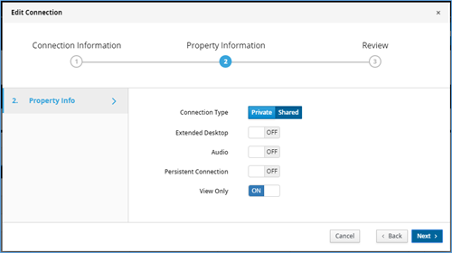

	
### User configuration and Management
	• Go to user >> Manage >> +user
	• Enter desired username and password.

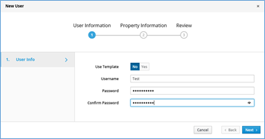

	• Click on Next
	• Select user privilege and select Auto connect ON/OFF

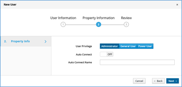

	• Adding devices to the users based on their Role. Click on grey color botton (Round in shape with 3 dots on it), then go to manage connections

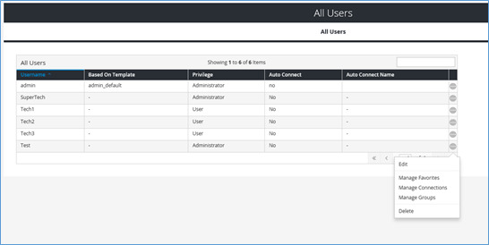

	•  Select the device and click on right arrow button
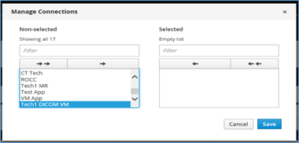

	•  click on save.

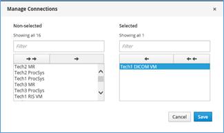

### How to Know Active users
Click on connection >> Active. This will display the active sessions

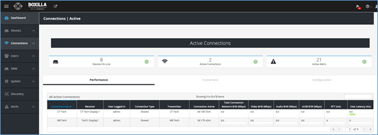

### Changing Display resolution on Transmitter.
	• Go to Devices >>Settings >> Click on Click on grey color botton (Round in shape with 3 dots on it), select edit settings

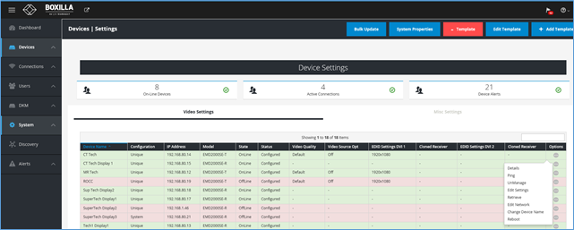

Select desired screen resolution from dropdown (EDID Settings DVI 1) and save

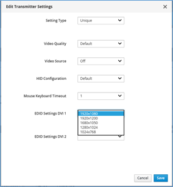

