## Anywhere app installation on Expert user's system

### Pre-Requisite

1. This Remote application works only on windows 10 OS (professional/enterprise/home) with .NET framework 4.6.1 onwards and user should have an admin privilege to download/install Emerald Remote Application on Laptop/Desktop.

2. The remote app pulls the required version of openssl and the Microsoft c++ redistributables (required by opennssl).

3. User is added in the Boxilla and user name and password is set.

### Installation Steps

1. Download  client Application from   https://share.philips.com/:u:/s/NBX-AcquisitionasaService/Efl0W3V4xxtJi0ShXDhdZzwBbB5qUpjtV6soXSqmLcJlHg?e=MuflC6on to local drive (Laptop/Desktop) where emarlad app need to be installed

2. Unzip and click on msi file. Click NEXT

	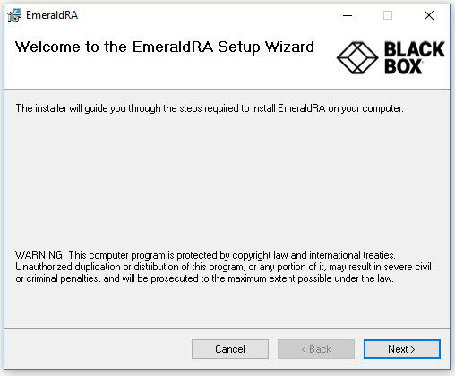
	
3. Accept License agreement and click NEXT

	
	
4.  Select appropriate option (Everyone or Just me) and click NEXT

	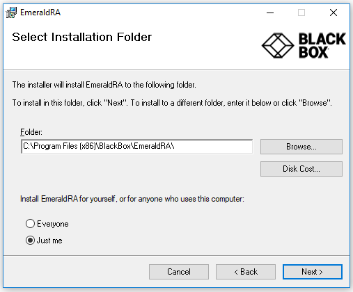
	
5. Click on Next to proceed and click on yes if any security pop up appears
	
	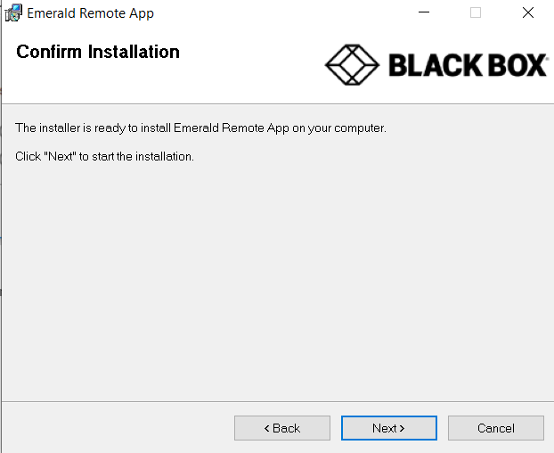
	
	
6. Click on YES to proceed installation
	
	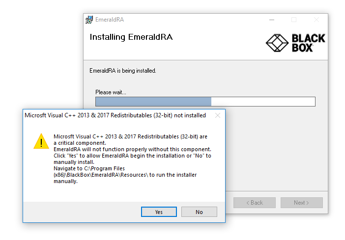
	
	
7. Installation is in progress

	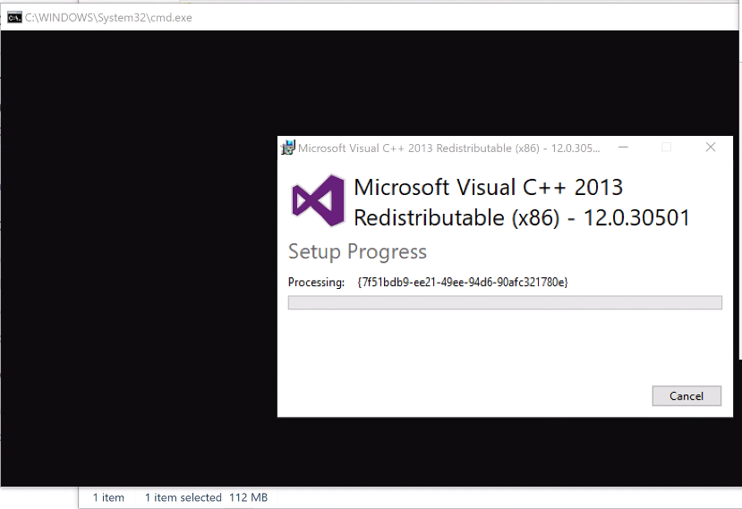
	
8. Click on close to complete the installation
	
	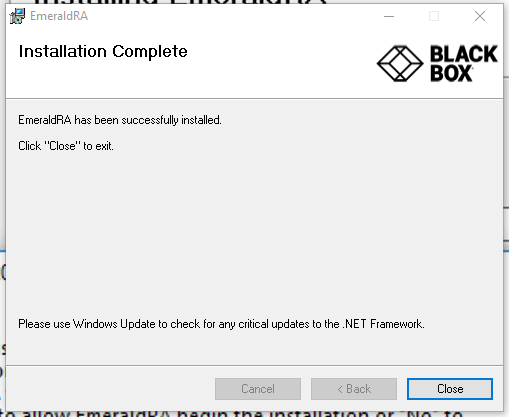
	
9. Launch Application (Shortcut created on Desktop). Click on YES

	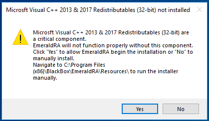
	
10. Click on YES

	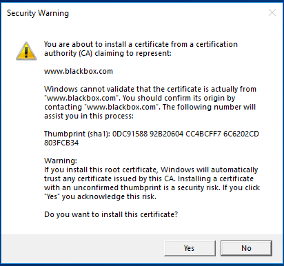
	

11. Configure ROCC Central Manager (Boxilla) IP address and click on Configure
	
	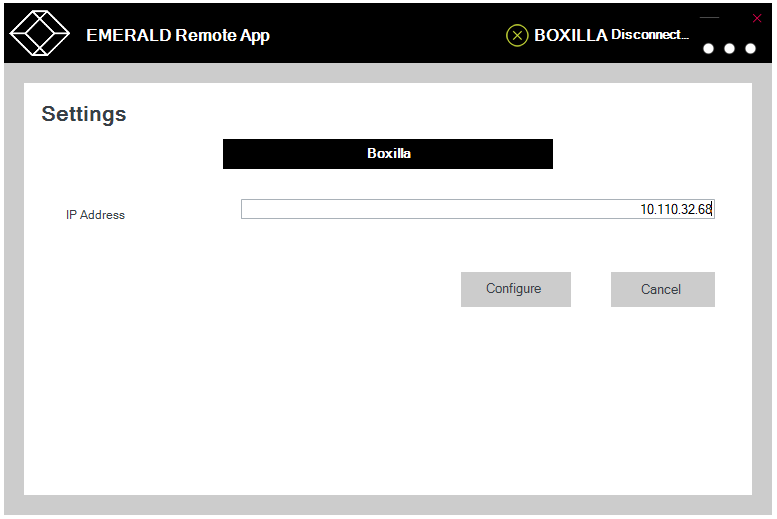

12.  Enter the username and password shared by PHILIPS Team

	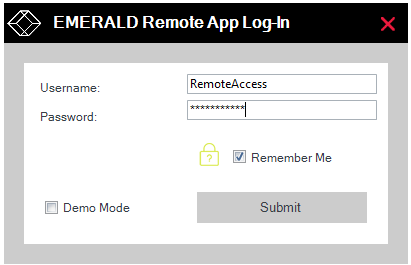

13. If authentication is successful, it will display the list of connections assigned to you/your role. Select the connection you would like to view/control and click on connect

	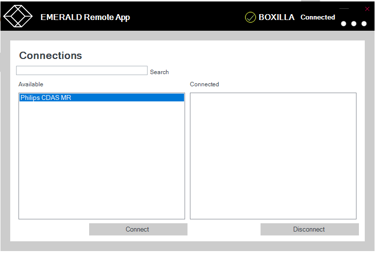
	
#### Changing Resolution 

1. By default window resolution will be Auto, if you would like to change resolution,  Click on options (three dots) go to setting >> Connection window and select resolution from drop down menu

	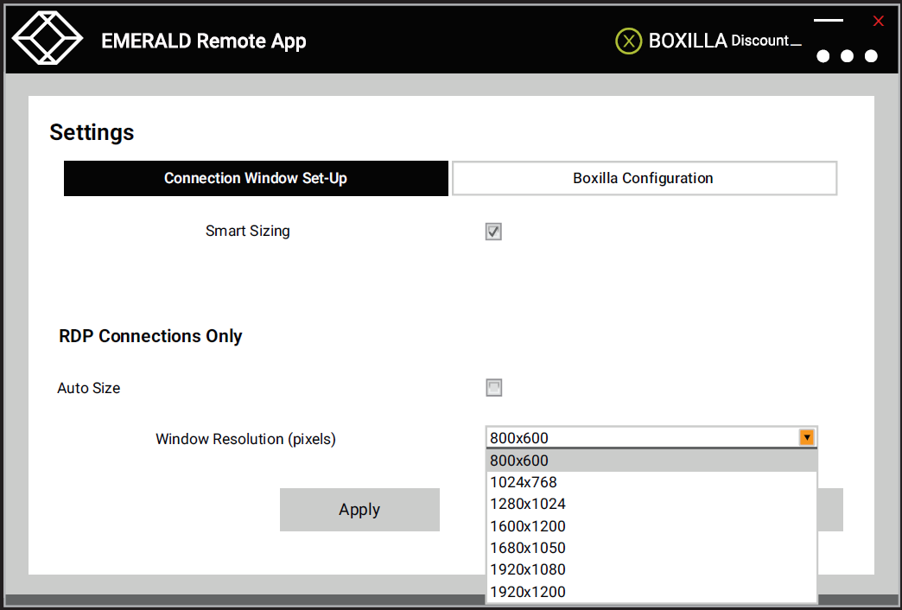
	
	
#### Dual Screen view via remote app

1. When Smart sizing is enabled, it fits the remote screen to the local display. So for dual output It compresses both the screens to be presented within our single monitor. In a laptop, this becomes extremely skewed/stretched. 

	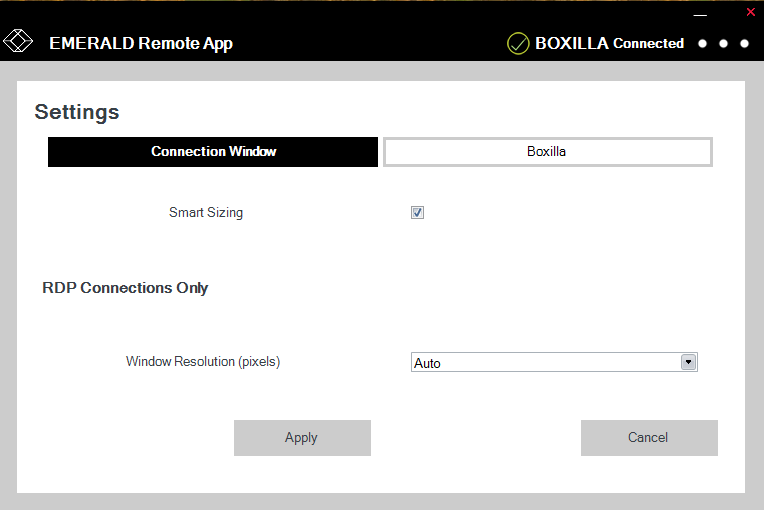

#### Smart Sizing 

1. If Smart sizing is disabled, it displays at actual size. For dual head – the view will make sense only if we have another monitor – then we can extend the display and have each screen output in one monitor. In this mode, even a single screen looks too large on a laptop 
	
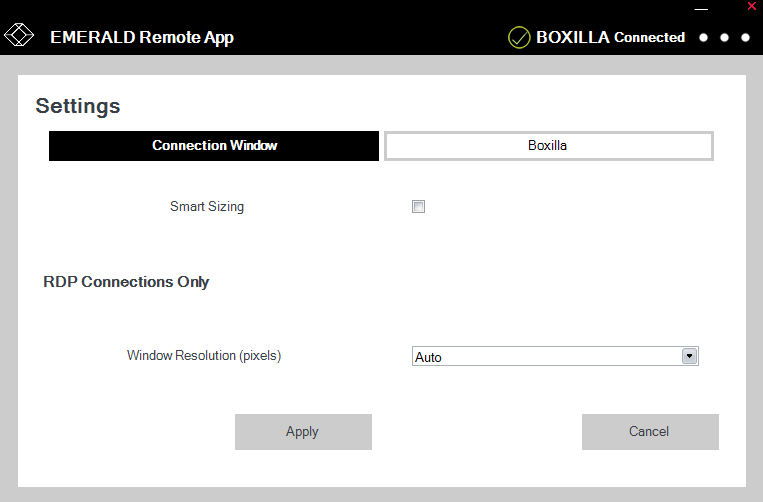