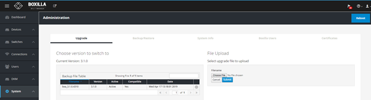
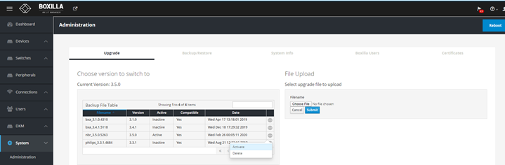
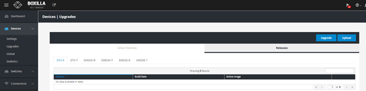
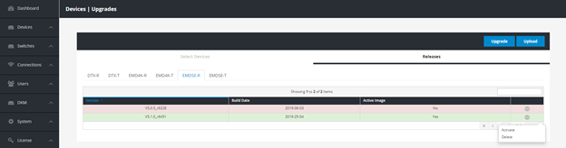
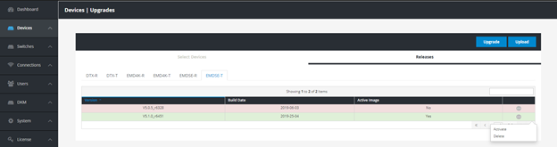
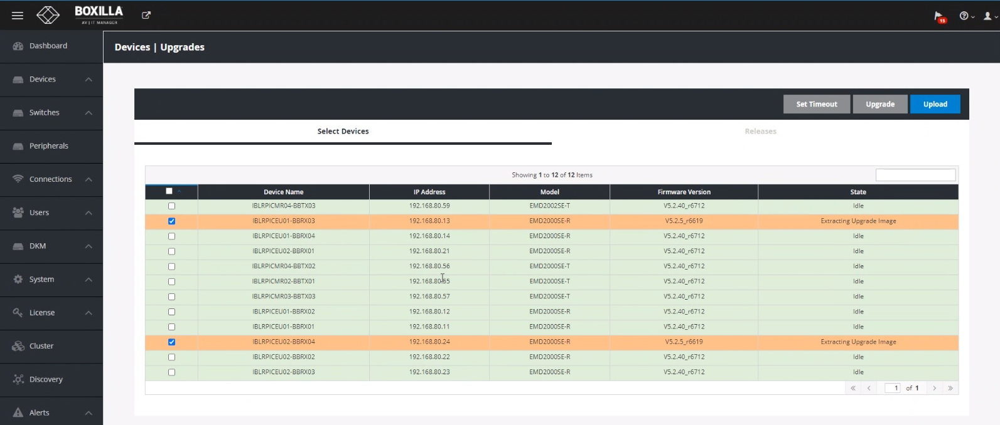
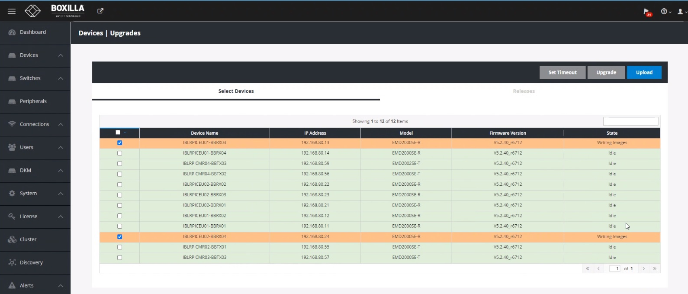
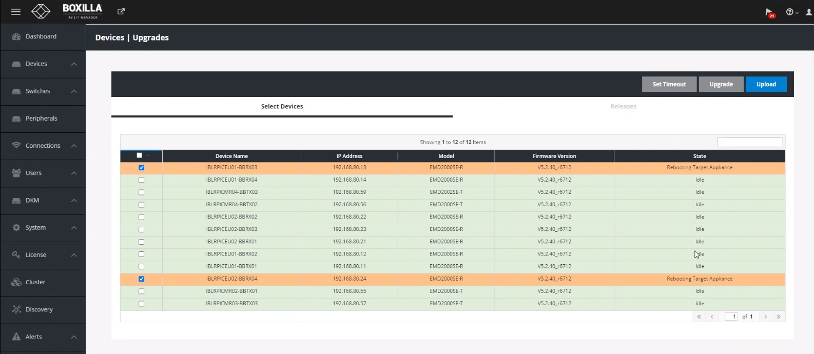
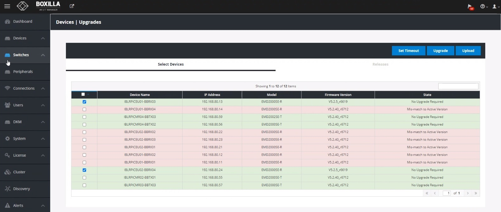
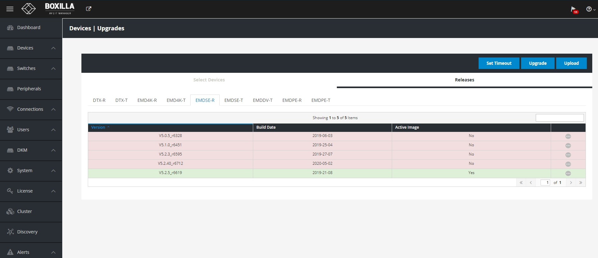

### Boxilla Firmware Upgrade

1. Download the latest approved firmware from Philips location onto a system (laptop/Desktop) from where Boxilla appliance is accessible.

2. Unzip both files, Boxilla and Receiver/Transmitter on local drive.

3. Login to appliance and perform sanity checks before firmware upgrade

4. Backup currently active firmware file navigating to Systemà Administration Backup/Restore, select the latest successful backup date and click grey colored round button on to the right hand side, click “Download” to download the backup file on to local system (laptop/desktop).

5. On the Boxilla appliance, navigate to System -> administration -> Upgrade. On right-hand side, under “Select file to upgrade” click “Choose file button” and choose the firmware file from the saved location. Click “Submit” button to upload the firmware on to appliance.
	
	
	
6. In couple of minutes, the Boxilla appliance will upload the new firmware file.
7. Verify the version change displayed in the table and click on grey color round button and select “Active” to activate the new firmware.
8. The appliance will display newer firmware version as “Active” in the “backup file table”.
	
	
	
9. Now Boxilla appliance is running on latest firmware.
 
### Transmitter and Receiver Firmware Upgrade
 
10. To upgrade Transmitter and Receiver Go To >> Devices >> Upgrade >>Releases
	
	
	
11. Select on EMDSE-R >> Click on upload and select Rx file. (Choose the firmware file from the saved location) and Click on grey color round button to activate.
	
	
	
12. Select on EMDSE-T >> Click on upload and select Tx file. (Choose the firmware file from the saved location) and Click on grey color round button to activate.
	
	

13. Now both Receiver and transmitter firmware is ready to push to Rx and Tx which are accessible from Boxilla.

14.  Select Devices and Click on Upgrade.
	
	
15. Now Boxilla will try to establish connection with transmitter and receivers and push/write firmware to successful connection. 
16. If Boxilla can't establish connection to transmitter and receivers check and fix connectivity issue, later initiate upgrade.

17. Device upgrade process status-1  after step-15
	
    

upgrade process status-2    

upgrade process status-3

  

18. After upgrade device status is displayed as below

    

19. Goto Devices-> Upgrades->Releases , verify for current activated version 

    