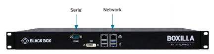
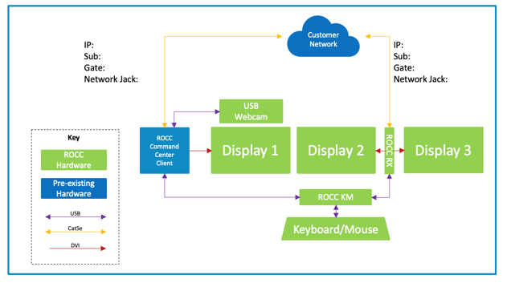
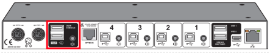
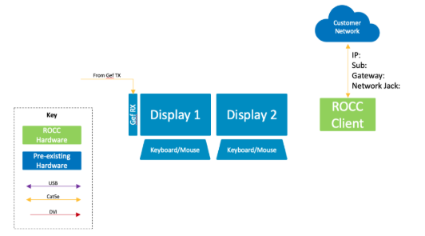
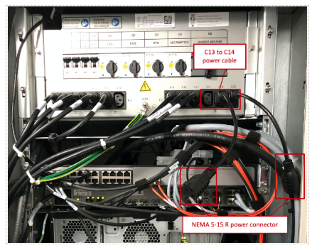

## Hardware Integration

### ROCC Deployment Sequence

## ROCC Central Manager – Installation Instructions 

The ROCC Central Manager is a one rack unit hardware appliance that is used to manage and configure the ROCC Spoke Relay Transmitters and ROCC Command Center Receivers. 

#### Installation Location
Customer’s data center

#### Prerequisite

Infrastructure 

1 x NEMA 5-15R Power Outlets 
1 x RJ45 Network Port and 2 x Cat5e or better network cable 

Network 
1 x Configured network port with intranet and internet access 

#### Installation steps

Please contact your Philips Remote Installation Engineer. The Philips Remote Installation Engineer will be accessing a web application to verify installation and configuration settings. 

1.	Rack mount the ROCC Central Manager
2.	Connect a customer provided network cable to the RJ45 network port above the blue USB ports on the ROCC Central Manager

 
3.	Connect the power from the ROCC Central Manager to customer provided power outlet
4.	Please contact your Philips Remote Installation Engineer so they can verify connectivity from the ROCC Central Manager to the ROCC Application Server
5.	Installation Complete

## ROCC Command Center – Installation Instructions

The ROCC Command Center is the physical station where an Expert User can communicate, request, and accept remote support to a Technologist Desk and view and control the associated Imaging Console Computer.

#### Prerequisite

1. ROCC Command Centers are a customer identified and dedicated space at one of the customer’s site locations. 

#### Infrastructure

1. 6 x NEMA 5-15R Power Outlets
2. 2 x RJ45 Network Port and 2 x Cat5e or better network cable

    
 

3. 1 x Command Center Client Computer with RJ45 network port 
and 2 USB2.0 or better ports

#### Network

2 x Configured network port with intranet and internet access

#### ROCC Command Center Dpeloyment Diagram

#### Installation Steps

1.	Locate the customer provided Command Center Client Computer
2.	Connect the power outlet from the Command Center Client Computer to a NEMA 5-15R power outlet
3.	Connect the customer provided network cable to the customer provided Command Center Client Computer
4.	Install the 3 x Philips provided displays
5.	Connect power from the 3 x Philips provided displays to 3 NEMA 5-15R power outlets
6.	Connect 1 x Philips provided displays to Command Center Client Computer using an HDMI or DisplayPort video cable
7.	Connect Philips provided USB webcam to a USB port on the Command Center Client Computer. Mount the USB webcam on one of the 3 Philips provided displays
8.	Identify the correct ROCC Command Center Receiver to be installed via MAC address or serial number. The MAC address and serial number can be located on the bottom of the unit.
9.	Connect 2 x Philips provided displays to the 2 x DVI ports on the back of the ROCC Command Center Receiver with a DVI cable.
10.	Plug the barrel connector of the power supply into the back of the ROCC Command Center Receiver. Plug the other end into a NEMA 5-15R outlet. Press the power button on the front of the ROCC Command Center Receiver, the LED indicator on the front should light up green.
11.	The Philips provided display connected to port 1 of the ROCC Command Center Receiver should display a boot screen
12.	Find the network cable provided by the customer. Plug this into the back of the ROCC Relay Spoke Transmitter. The LED indicators on the network port of the ROCC Relay Spoke Transmitter should start flashing after 2 minutes. 
13.	Locate the Philips provided ROCC KM Switch
14.	Plug the power from the ROCC KM Switch into a NEMA 5-15R power outlet. 
15.	Plug a USB Type B cable into the back of the ROCC KM SWITCH unit into port 1. Connect the USB Type A side into the back of the Command Center Client Computer into a USB 2.0 port
16.	Plug a second USB Type B cable into the back of the ROCC KM SWITCH unit into port number 2. Connect the USB Type A side into one of the USB ports on the back of the ROCC Command Center Receiver
17.	Plug a USB Keyboard and USB Mouse into the Mouse and Keyboard port on the back of the ROCC KM SWITCH unit. The Mouse and Keyboard port are located on the left of Port 4, this is circled in the figure below. 

    

18.	Please contact your Philips Remote Installation Engineer so they can verify connectivity from the ROCC Central Manager to the ROCC Command Center Receiver
19.	Installation Complete

## ROCC Technologist Client - Installation Instructions

The ROCC Technologist Client is the interface for the Technologist to communicate, request, and accept remote assistance from an Expert User accessing from a ROCC Command Center or an ROCC Anywhere Application.

#### Typical Installation Location

At a location on the Technologist’s Desk that provides a good viewing angle and distance. The ROCC Technologist Client should as also be within arm’s reach for easy access to the touch screen interface. 

#### Prerequisites - Customer provided and configured

#### Infrastructure

1. 1 x NEMA 5-15R Power Outlet
2. 1 x RJ45 Network Port and 1 x Cat5e or better network cable

    

3. 1 x 12.8” x 15.5” x 6.3” surface on the Technologist table for placement of the ROCC Technologist Client. 

#### Network
1 x Configured network port with intranet and internet access

#### ROCC Technologist Station

   

Installation Steps

1.	The installation of the ROCC Technologist Client will not have any impact on the Imaging Scanner. However, depending on the physical space constraints of the Technologist desk it may be ideal install when the Technologist is in between patients and can vacate the desk area.
2.	Install the ROCC Technologist Client dock. This is the Kensington SD7000 dock. Connect the power connector from the dock to an available outlet or power strip.
3.	Install the dock lock.
4.	Connect the customer provided network cable to the network port on the back of the Kensington SD7000 dock.
5.	Identify the correct ROCC Technologist Client. The Client should be labeled, or verification can be performed by referencing the serial number on the [customer config sheet document]
6.	Install the ROCC Technologist Client by sliding it into the ROCC Technologist Client dock.
7.	Power on the ROCC Technologist Client by holding the power button on the top right-hand side of the Client until you see a windows logo on screen.
8.	Please contact your Philips Remote Installation Engineer to so they can verify connectivity of the ROCC Technologist Client to the ROCC Application Manager
9.	Installation Complete

## ROCC Spoke Relay - Installation Instructions

The ROCC Spoke Relay connects to the video and USB ports of the Imaging Console Computer. The video connection provides a replicated view of the Imaging Console Computer for Expert Users at Command Center Stations or ROCC Anywhere Application. The video output of the Imaging Console Computer is reproduced to provide a video connection for the Local Technologist and the ROCC Spoke Relay.	

#### Typical Installation Location

In the Equipment Rack

#### Prerequisites - Customer provided and configured

#### Infrastructure

1. 2 x C13 Power Outlets
2. 1 x RJ45 Network Port and 1 x Cat5e or better network cable

     

#### Network

1 x Configured network port with intranet and internet access

#### ROCC Spoke Relay Equipment Room

  

#### Installation Steps

Please perform when scanner is NOT in use. Please perform during off hours.
Please contact your Philips Remote Installation Engineer. The Philips Remote Installation Engineer will be accessing a web application to verify installation and configuration settings. 

1.	Identify the correct ROCC Relay Spoke Transmitter to be installed via MAC address or serial number. The MAC address and serial number can be located on the bottom of the unit.
2.	Plug the barrel connector of the power supply into the back of the ROCC Relay Spoke Transmitter. Plug the other end into the Imaging Equipment rack PDU using a NEMA 5-15R to C14 adapter cable. The LED indicator on the front of the ROCC Relay Spoke Transmitter should light up green.

    
 
3.	Find the network cable provided by the customer. Plug this into the back of the ROCC Relay Spoke Transmitter. The LED indicators on the network port of the ROCC Relay Spoke Transmitter should start flashing after 2 minutes. 
4.	Locate the correct video splitter for this modality by referencing your [Configuration Sheet Name]. Connect the video splitter power into the Imaging Equipment rack PDU using a NEMA 5-15R to C14 adapter cable. The LED indicator should on. If the Imaging Console Computer is dual video, you will need to connect and power up two video splitters.
5.	Connect a video cable from the second output port of the video splitter(s) to the previously installed video input port of the ROCC Relay Spoke Transmitter.
6.	Verify what the video cable from the Imaging Console Computer is connected to. If you are in an equipment room, it will typically be connected to a video extender. Locate the video extender. If you are at the Technologist desk the video cable from the Imaging Console Computer should be connected to a computer monitor. Disconnect the video cable from the video extender or the computer monitor. Connect this cable to the input port of the video splitter(s).
7.	Using a new video cable please connect one end to the first output of the video splitter(s). Please connect the other end to the video extender or the computer monitor.
8.	Locate a USB Type B to USB Type A cable. Connect the type B side to the back of the ROCC Relay Spoke Transmitter. Connect the type A side to an open USB 2.0 port on Imaging Console Computer. Note that USB 2.0 ports are typically black and USB 3.0 ports are typically blue.
9.	Proceed to verify normal functionality at the Technologist desk. If there is no image on the Technologist Desk monitor the EDID setting will need to be configured on the video splitter. Please see EDID setting instructions in the Appendix.
10.	Once normal functionality at the Technologist desk is verified please contact your Philips Remote Installation Engineer so they can verify connectivity from the ROCC Central Manager to the ROCC Relay Spoke Transmitter.
11.	Installation Complete

## Hardware is unconfigured/factory prior to delivery to customer

Philips will discuss with the customer whether the ROCC Hardware will be pre-configured or not. If Philips and the Customer agrees to deliver the ROCC Hardware unconfigured/factory settings prior to delivery, please follow the instructions in this section.

#### Typical Installation Location
Customer Data Center or Customer staging area

####	Prerequisites – Customer provided and configured

#### Infrastructure
1. 1 x NEMA 5-15R Power Outlets per ROCC Spoke Relay Transmitter or ROCC Command Center Receiver

2. 1 x RJ45 Network Port and 1 x Cat5e or better network cable per ROCC Spoke Relay Transmitter or ROCC Command Center Receiver

#### Network
1. 1 x Configured network port with intranet and internet access per ROCC Spoke Relay Transmitter or ROCC Command Center Receiver

####	Installation Steps

1. With your Philips Remote Installation Engineer please complete  ROCC Central Manger Installation and Configuration
2. Plug and power on as many ROCC Spoke Relay Transmitters or ROCC Command Center Receivers as your infrastructure permits. There is no limit to the number that can be configured simultaneously. The more that are connected the faster the configuration process.
3. Connect as many ROCC Spoke Relay Transmitters or ROCC Command Center Receivers to your network as your infrastructure permits, again, there is no limit. 
4. Contact your Philips Remote Installation Engineer, they will be able to remotely configure all ROCC Spoke Relay Transmitters and ROCC Command Center Receivers.
5.	Power down, disconnect and repackage ROCC Hardware components. 
6. 	Installation Complete
