### SurfacePro setup

### Linking a Surface Pro Windows 10 tablet to Azure to Active Directory Domain

#### Prerequisites
• Make sure the Microsoft Surface Pro tablet for business is used.
• Make sure the Microsoft Surface Pro tablet is working fine, without any physical damage.

• Make sure the power adapter is plugged-in and power pin is attached to the magnetic power port of the tablet.
>**Note:** It is recommended not to proceed further If you notice any physical damage to the
device. Make a note of the damage, report to the concerned people and arrange for a
replacement of the device.
If you do not obey these instructions, there is a risk of property damage.

• Verify if the power LED (White LED) is "ON" to confirm power supply to the device.
• Ensure the Microsoft Surface Pro tablet has Internet connectivity either by ethernet connection
(through Kensington docking station) or by Wi-Fi hotspot to the tablet.

• If you are using ethernet connectivity, check the ethernet port lights to confirm if the network connection to the device is active:
• The Link, (Green LED),
• The Activity, (Orange LED)

• If you are using Wi-Fi hotspot, ensure you have the right SSID, key and the configuration parameters in place.

• Make sure, you have a new ROCC line Azure Active Directory Domain User Credentials ready before you start.

• Make sure Microsoft Windows 10 business or professional edition is procured with the Surface Pro
tablet.

#### Setting-up the Tablet
1. Power on the device and let Windows 10 boot up.
The Continue in selected language? page displays.
2. Select English (United States), and click Yes.

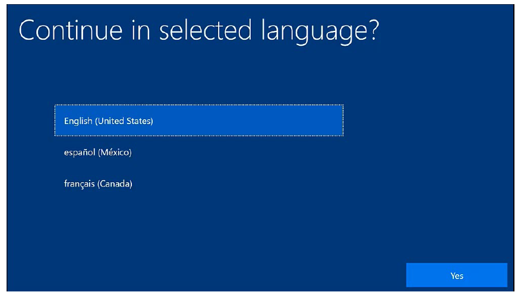

3. Select United States and Click Yes.

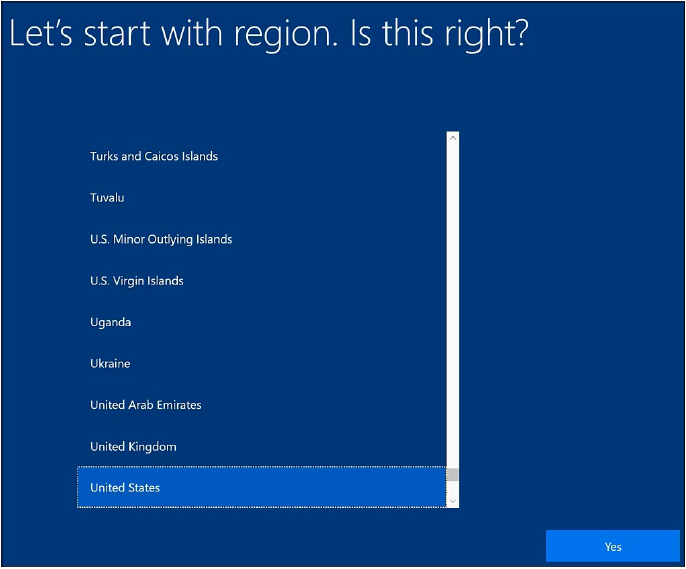

4. Select US in keyboard layout and click Yes.

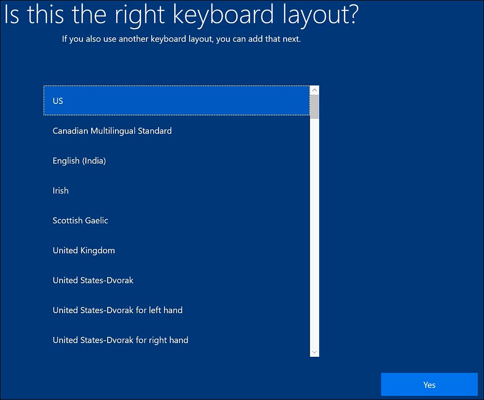

5. The page to add a second keyboard layout displays. Select Skip. The setup performs few back-end processes, this will take few minutes

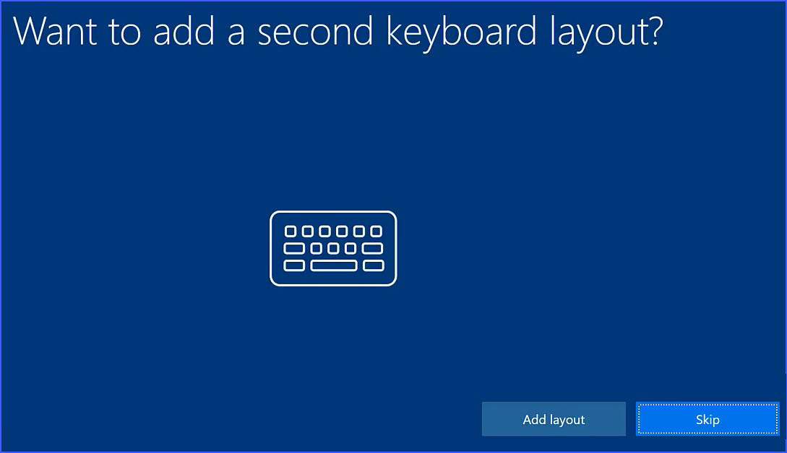

6. The Windows 10 License Agreement page displays. Read the license agreement and click Accept to proceed.

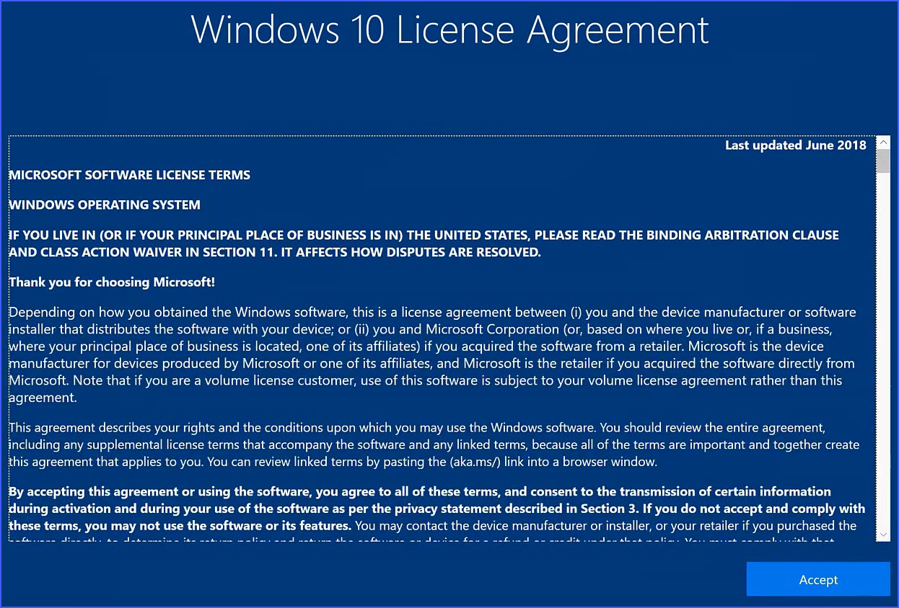

7. The Set up page displays. Select the Set up for an organization option and click Next

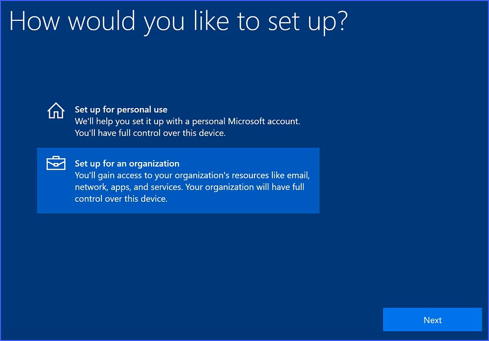

8. The Sign in with Microsoft page displays. Enter the User Principle Name the Device ID, and click Next

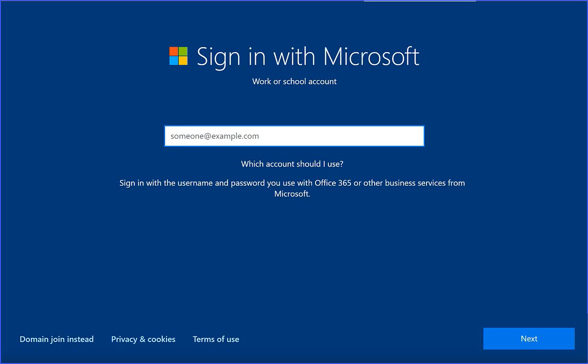

>**Note:** 
Make sure the account used to login must have local administrative privileges on the tablet.
For example, you can use the user account that was used for the first time when the tablet was set
up, or you can also use a local administrator account to log in and perform Azure AD join process.

9. Enter password.

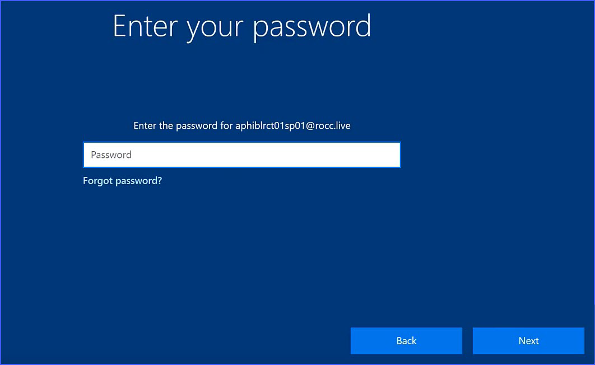

The Azure Active Directory Domain joining process will be initiated in the background

> **Note:** If you encounter any error during this process, try again with the credentials. If you do not succeed,
please contact the ROCC Service Organization for troubleshooting process.

10. The Do more across devices with activity history page displays. Click No.

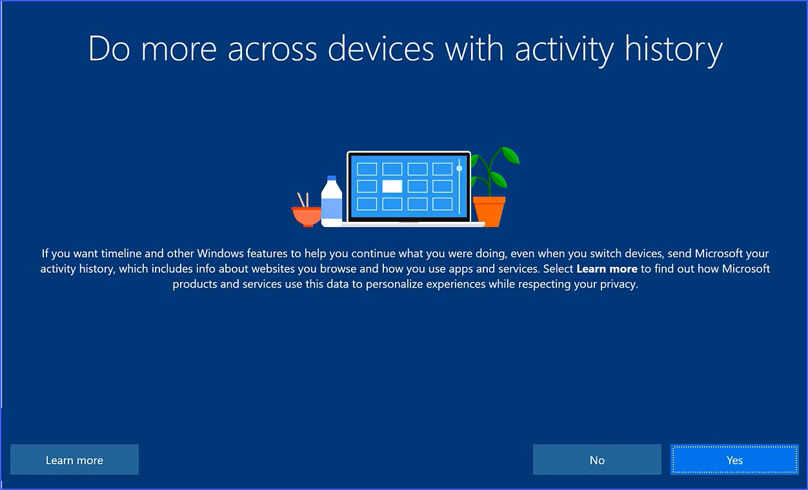

11. The Choose privacy settings for your device page displays. Choose the setting as mentioned below. Click Accept.
The Azure ID User Profile is created in the background. 

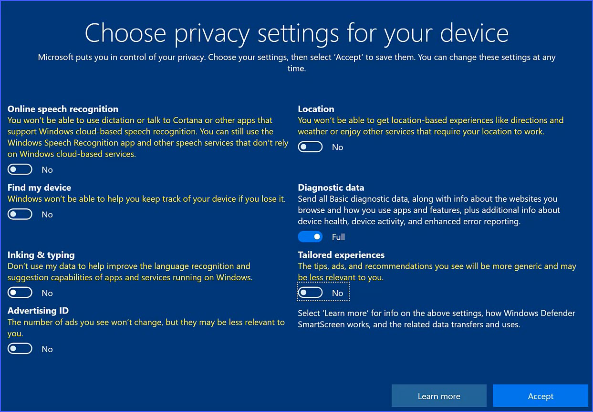

12. The user Desktop will be presented. This might take several minutes

### Linking the Surface Pro Tablet to Azure Active Directory Domain

1. Once Windows 10 Desktop is presented after successful setup of the tablet, do the following:

2. Navigate to Windows Settings window.

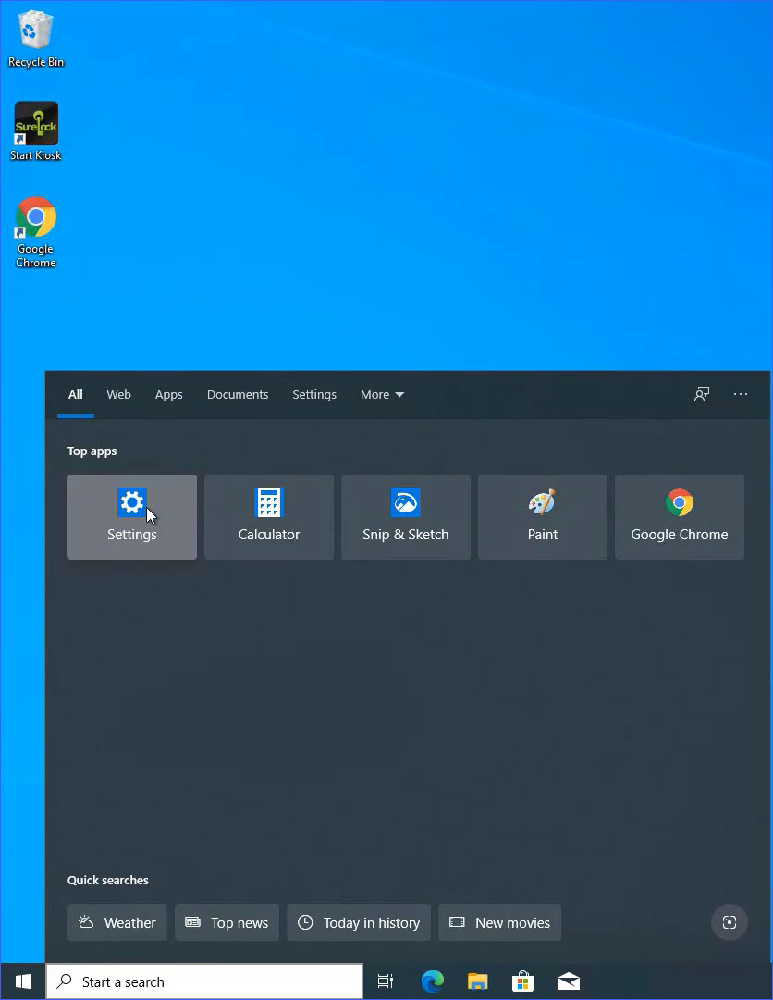

3. Select Acoounts 

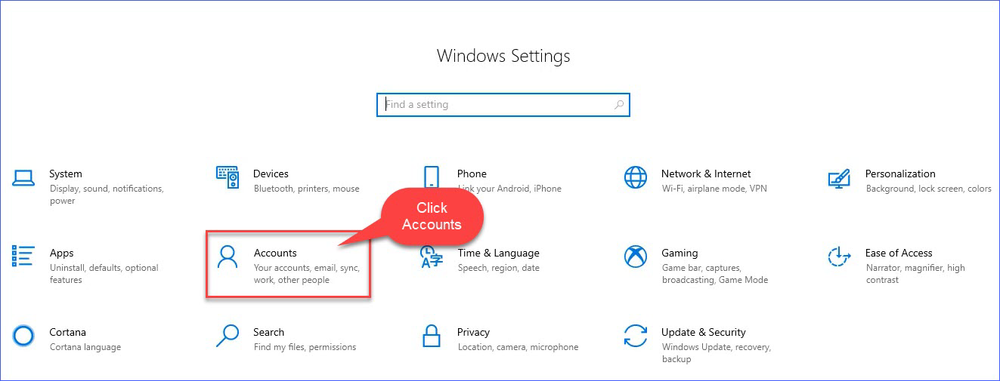

4. Select Access work or school option

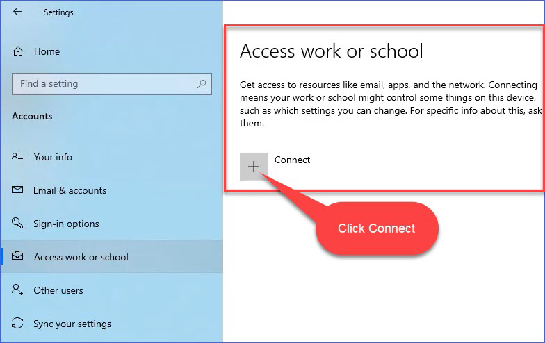

5. In Microsoft account page, select Join this device to Azure Active Directory link under Alternate actions.

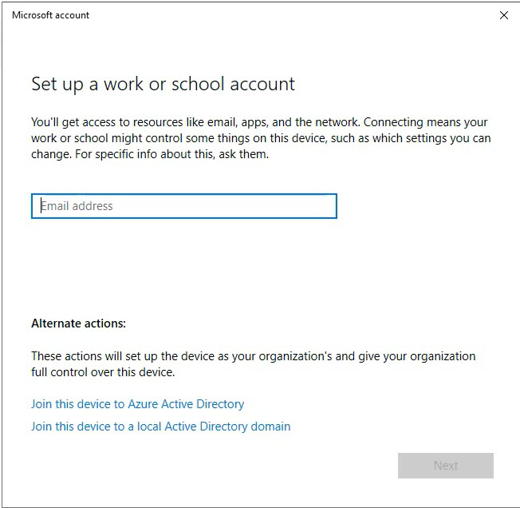

6. Enter the complete user principle name in the Work or school account field.

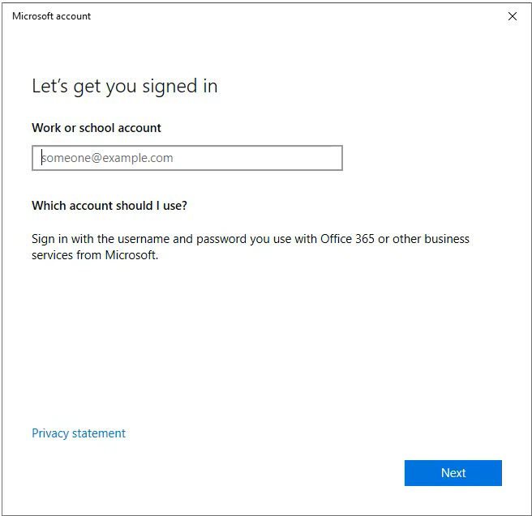

7. Enter the password and select Next

8. The process of linking the Microsoft Surface Pro Tablet with the ROCC Azure Active Directory in
initiated in the background and the message "Just a moment" displays

9. Click Join in the Make sure this is your organization page after verifying the details.

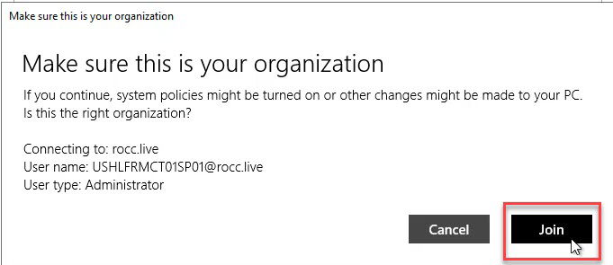

>**Note:** The tablet is being connected to the domain in the background and this process might take few
minutes.

10. Once the tablet is successfully connected to the ROCC Azure AD domain, the You're all set! page displays.
16. Click Done.
17. You will be taken back to the Settings --> Accounts page. The Connected to ROCC's Azure AD
message displays with the user principle name that was used join the tablet to Azure AD as shown
below.

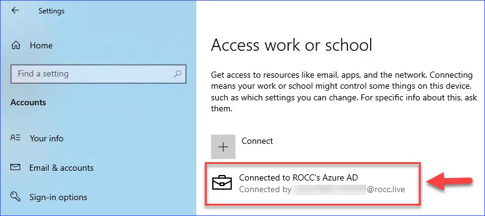

18. Reboot the Tablet and login with the Azure Active Directory account.

### KIOSK mode installation

#### Pre-conditions:
* SurfacePro should be joined to Azure domain
* Verify that device policy has been assgigned to the group for which SurfacePro is added 

#### Installation:
* Download rocc-suface-pro-install-VERSION.zip to c:\temp folder
* unzip rocc-suface-pro-install-VERSION.zip
* goto folder C:\temp\rocc-suface-pro-install-VERSION 
* Right Click on Install.bat file and Run as Administrator.
    - Enter the customer org  name in rocc for configuring ROCC Application URL on promt

