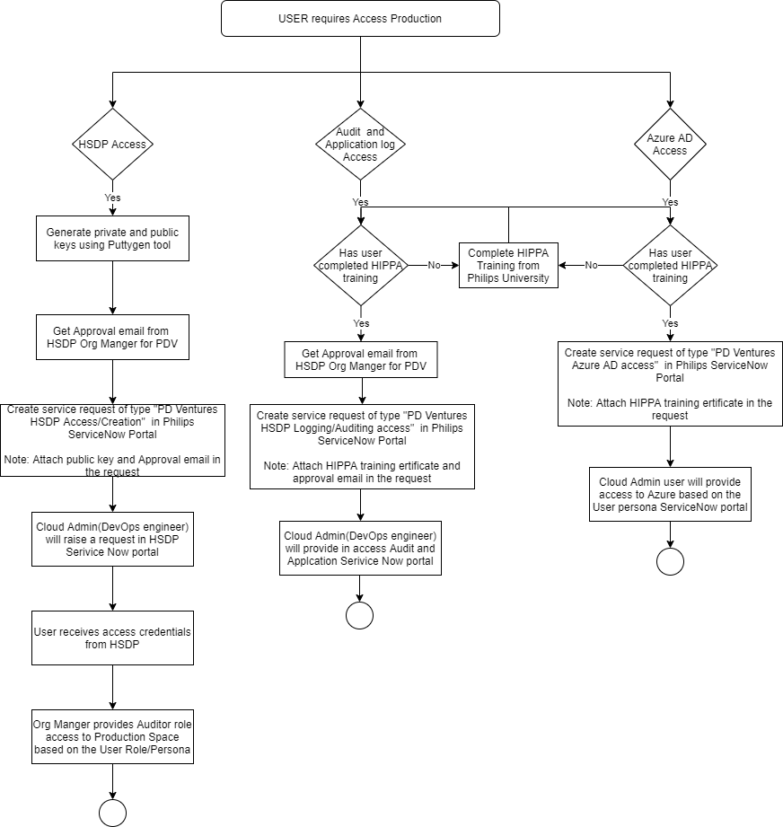

## ROCC User Personas 

Refer to the below excel for User Personas and their access control in HSDP and Azure 

Read more [here](media/ROCC_User_Personas_Role_mapping.xlsx) 

## Workflow: Access request to ROCC Production

## Service Engineer On-boarding

### Service Engineer on-boarding to HSDP 

Service Engineer would need following access on HSDP: 

* Access Monitoring Dashboard of Production ROCC Service instance (WIP with HSDP) 

* Should able to login to ROCC Application (Customer end URL) 

* Application Logs and Audit logs on request from customer 

* Application Dry run to verify the deployments 

Service Engineer/Support Desk engineer shall use service account to login to ROCC application (customer specific URL) and manage Users and Locations for the customer 

* rocc_solutiondelivery@philips.com - for service engineer 
* rocc_servicedesk@philips.com - for support desk 

>**Note:** Password need to reset every three month for these service user account 

For Application dry run during deployment, following users are added into customer specific instance of the ROCC solution: 

* Expert users: Philips_Expertuser1@rocc.live,  Philips_exprtuser2@rocc.live 
* Technologist: Philips_technologist@rocc.live 

>**NOTE:** Post dry run test completion, the dry run test users are deleted from ROCC application (Customer tenant) 

### Audit and Application log access  

If Service Engineer/Support desk engineer need access to Audit logs then he need to follow below procedure 

1. Complete HIPPA training from Philips University if he has done already 

    * Go to My University and complete the HIPAA training  https://philips.csod.com/ui/lms-learner-home/home?tab_page_id=-200300006&tab_id=-2  
    * Complete the HIPAA training ("Protecting Patient Health Information under HIPAA – HEA109")  
    * Download the certificate  

2. Rise "PD Ventures HSDP Logging/Auditing access"  request from Philips IT portal 
    * Go to Philips IT Portal - https://philips.service-now.com/itportal  
    * Click on Submit a request  
    * In the Search Bar, enter text "PD Ventures HSDP Logging/Auditing access"  

        
    
    * Fill the request the form 
        * Business reason 
        * Attach the HIPPA training completion certification
        * Enter the date of implementation as "Current date"

        

    * Click on "Order Now"  
    * ROCC Cloud Admin (DevOps engineer) will full fill the requirement 

### Service Engineer on-boarding to Azure 

Porcedure to get Azure AD account access on ROCC Live domain 

1. Complete HIPPA training from Philips University if he has done already 

    * Go to My University and complete the HIPAA training  https://philips.csod.com/ui/lms-learner-home/home?tab_page_id=-200300006&tab_id=-2  
    * Complete the HIPAA training ("Protecting Patient Health Information under HIPAA – HEA109")  
    * Download the certificate  

2. Rise "PD Ventures Azure AD Access"  request from Philips IT portal

    * Login into IT Portal  - https://philips.service-now.com/itportal
    * Click on Submit a request  
    * In the Search Bar, enter text "PD Ventures Azure AD Access"  
        
        
    
    * Fill the request the form 
        * Business reason 
        * Attach the HIPPA training completion certification
        * Enter the date of implementation as "Current date"

        

    * Click on "Order Now"  

    * ROCC Cloud Admin (DevOps engineer) will full fill the requirement 

 
