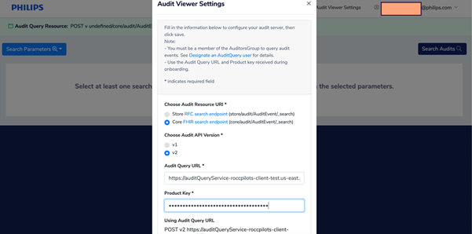
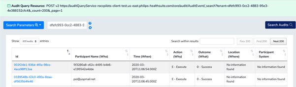
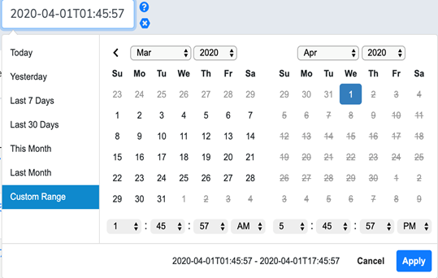

## Viewing Audit logs 

>**Note:** Philips ROCC customer can raise a request for audit information via Philips service desk. Philips service desk would internally work with relevant stake holders  to review the request and initiate audit retrieval for the request made. The following information shall be provided to Philips service desk to get precise information.
•	Customer Name
•	Audit Event Date and Time 

### Pre-requisites

1. The user must have IAM account and IAM org.
2. The user must be onboarded to HSDP auditing service and have audit query URL and Product key (which will be provided as part of onboarding SDT/ Email)

### Instructions
 
#### Steps to Login to Audit Viewer:

1. Go to the auditURL Link provided as part of onboarding and click on log-in.
[URL] (https://audit-viewer-client-test.us-east.philips-healthsuite.com/)

2. Upon clicking Log-in, IAM Authorization Server Information screen is displayed. 
3. Select the proper Authorization URI according to the region and environment (dev, production), and provide details of Client Authorization, Client Secret which will be provided as part of onboarding. Click on Authorize.
3. Enter your Username and password and click on log-in
4. Fill in the details of Audit Query URL and Product key and save

5. In the search screen where user can search data, provide at least one parameter and click on search to get data.

6. In search parameter drop down select tenant. And provide the organization id as parameter. And click on search audits to get the audit logs for the organization.

#### Search Criteria

The various combination of search parameters along with tenant are as follows.

1.  Date/ lastupdated date:  String: Date Time to be given as UTC format.

2. User: 
String: userID/ username

3. Application: 
String: Name of Application like IAM, Communication Service etc.

4. EventOutcome: 
Integer: Defines the outcome for which audit event is captured. [0- Success, 4- Minor failure,8-Serious Failure,12- Major failure]
 
5. Action: 
String: Defines the type of action performed during the event. 
[C- Create, R- Read/View/Print, U- Update, D- Delete, E- Execute]

