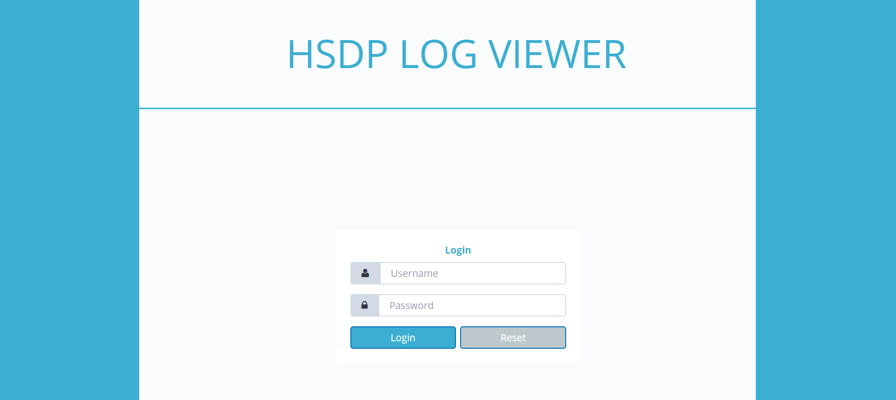
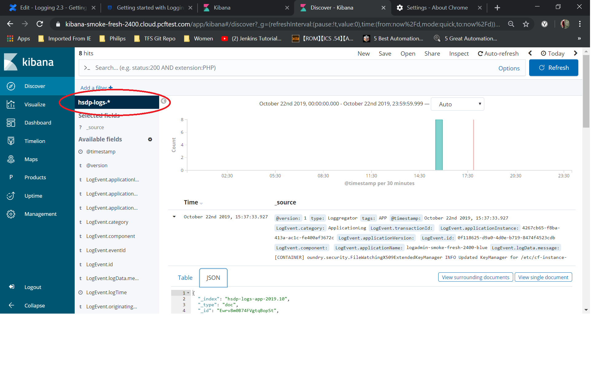
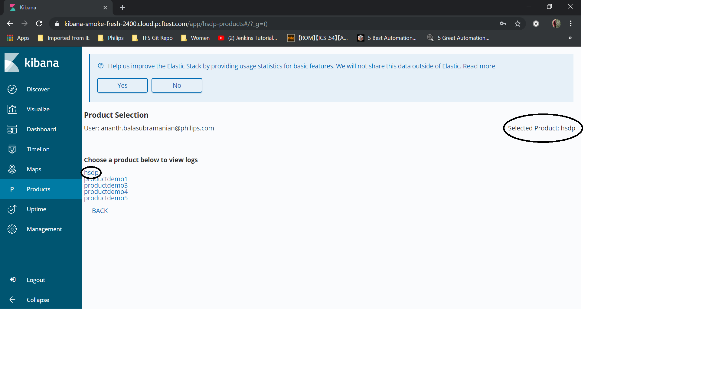

### Accessing HSDP logs

1. Go to the Kibana URL that is provided in your Logging service request email, e.g., "https://kibana8675-dev.philips-healthsuite.com"

2. Log in with your IAM user credentials.

3. Click Discover to see some product logs. The default project’s logs appear on this page.

4. If you have access to multiple products, click Products to select another product.

5. After the product is selected and the BACK button is clicked, you will be redirected to the Discover page for that selected product so you can then view the logs under that product.

​​​​​​​To finish viewing log messages, click Logout.

#### Working with Kibana

Keep these things in mind as you use Kibana:

• When you look at log messages in Kibana, the Time field that is displayed beside the log message details is displayed in the browser’s default time zone (@timestamp field). However, the actual timestamp captured in the log data is in UTC (LogEvent.LogTime). Take this into consideration when doing searches or looking for events that happened at a specific time.

• If your session times out because you have a Kibana session open but inactive, when you click on any of the tabs, you will be redirected to login page. The default session timeout for all Kibana6 sites is 30 minutes.

• The site does not track what your last selected product is so upon login you will always be presented with the logs for the first product listed on the Products page (products are listed in alphabetical order).

• The recommended browser for Kibana is Chrome
