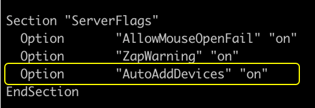
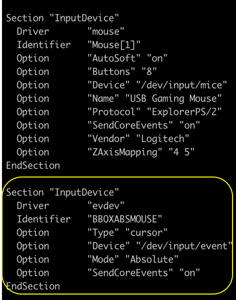

### GE Signa HDX MR Scanner - Mouse misalignment Fix 


**Step 1:**  Login as root and navigate to /etc/X11 directory using below command

    cd /etc/X11/


**Step 2:** Edit xorg.conf file to add BBOXABSMOUSE device as below
    
Option    “AutoAddDevices” “on”


 

Add following section below the Mouse[1] input device.

    Section "InputDevice"
    Driver       "evdev"
    Identifier   "BBOXABSMOUSE"
    Option       "Type" "cursor"
    Option       "Device" "/dev/input/event"
    Option       "Mode" "Absolute"
    Option       "SendCoreEvents" "on"
    EndSection


	 

Add line below line to server layout.

InputDevice  "BBOXABSMOUSE" "SendCoreEvents"
    
Save file and exit

**Step 3:** Download and copy script to /etc/init.d/check_event_boot

```bash
    #! /bin/sh
    # chkconfig: 5 98 10
    ### BEGIN INIT INFO
    # Provides:          check_event_boot
    # Required-Start:    $local_fs
    # Required-Stop:
    # Should-Start:      xdm
    # Should-Stop:
    # Default-Start:     5
    # Default-Stop:
    # Description:       Routine to start check_event_boot at system startup
    ### END INIT INFO
    event=$(readlink /dev/input/by-id/usb-Custom_Cloud_Device_Custom_Cloud_Device-event-joystick | awk '{print substr($0,4)}')
    if [ -z "$event" ]
    then
        sed -i s'/\"Device" \"\/dev\/input\/event.*\"/\"Device" \"\/dev\/input\/event\"/' /etc/X11/xorg.conf
    else
         sed -i s'/\"Device" \"\/dev\/input\/event.*\"/\"Device" \"\/dev\/input\/'$event'\"/' /etc/X11/xorg.conf
    fi
```
	

**Step 4:** give executable execute  permission and convert script as a part of init process
    
``` 
    chmod u+x /etc.init.d/check_event_boot
    
    #Activate init script by running below command
   
    insserv /etc.init.d/check_event_boot
        
    Reboot server
```

### Identifying dual mouse support on GE Scanner Machine
 
Apart from checking physically, we can also check dual mouse support from /etc/X11/xorg.conf file.

Check if below lines are present inside xorg.conf file to confirm dual mouse support

```
InputDevices "/dev/input/mice"

and 

Section "InputDevice"
    Identifier     "Mouse[1]"
    Driver         "mouse"
    Option         "Buttons" "12"
    Option         "Device" "/dev/input/mice"
    Option         "Name" "Logitech USB Optical Mouse"
    Option         "Protocol" "explorerps/2"
    Option         "Vendor" "Sysp"
    Option         "ZAxisMapping" "4 5"
EndSection
```
