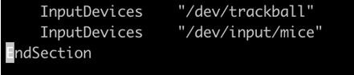
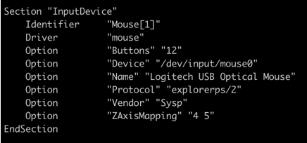
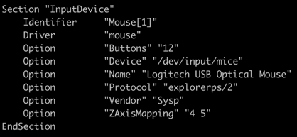
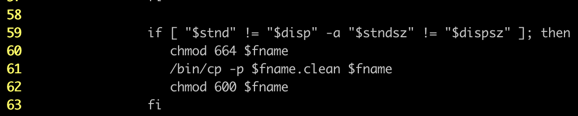
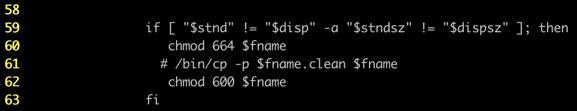

### Identifying dual mouse support on GE Scanner Machine
 
Apart from checking physically, we can also check dual mouse support from /etc/X11/xorg.conf file.

Check if below lines are present inside xorg.conf file to confirm dual mouse support

```
InputDevices "/dev/input/mice"

and 

Section "InputDevice"
    Identifier     "Mouse[1]"
    Driver         "mouse"
    Option         "Buttons" "12"
    Option         "Device" "/dev/input/mice"
    Option         "Name" "Logitech USB Optical Mouse"
    Option         "Protocol" "explorerps/2"
    Option         "Vendor" "Sysp"
    Option         "ZAxisMapping" "4 5"
EndSection
```


### Enabling dual mouse support on GE Scanner Machine

**Step 1:** Get in to C-shell from GE application.


**Step 2:** Switch to root user.


**Step 3:** Switch to /etc/X11/ directory by executing below command.

    cd /etc/X11/


**Step 4:** Take backup of xorg.conf file by executing below command
       
    cp -p xorg.conf xorg.conf_philips_backup (you can give any file name)


**Step 5:** edit xorg.conf file using gedit using below command.

    gedit xorg.conf


**Step 6:** add line InputDevices "/dev/input/mice" below the line


    InputDevices	"/dev/trackball"

    It should look something like below
    
        InputDevices "/dev/trackball"
        InputDevices "/dev/input/mice"




    search for Section "InputDevice" which contains mouse0 settings and change mouse0 to mice

    Before change


 
    After Change


 

    Save xorg.conf file and exit


**Step 7:** Switch to /etc/init.d/rc5.d using below command

    cd /etc/init.d/rc5.d


**Step 8:** Take backup of K01ct_oc_boot file using below command

    cp -p K01ct_oc_boot /opt/K01ct_oc_boot_backup

    #Note: don’t copy file in same directory, try copying in /opt or any other directory.


**Step 9:** edit K01ct_oc_boot using gedit

    Comment out line number 61

    Before change


 
    After change

 

    Save K01ct_oc_boot and exit.

**Step 10:** Reboot machine.
